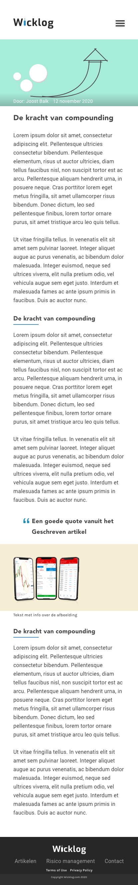
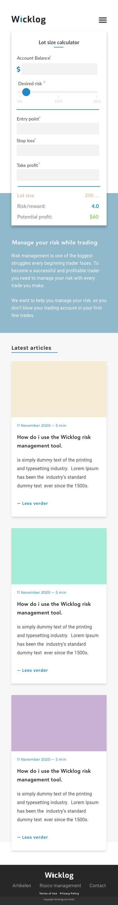

# Procesverslag
**Auteur:** -Joost Balk 500772067-

Markdown cheat cheet: [Hulp bij het schrijven van Markdown](https://github.com/adam-p/markdown-here/wiki/Markdown-Cheatsheet). Nb. de standaardstructuur en de spartaanse opmaak zijn helemaal prima. Het gaat om de inhoud van je procesverslag. Besteedt de tijd voor pracht en praal aan je website.

## Bronnenlijst
1. -bron 1-
2. -bron 2-
3. -...-

## Eindgesprek (week 7/8)

-dit ging goed & dit was lastig-

**Screenshot(s):**

-screenshot(s) van je eindresultaat-

## Voortgang 3 (week 6)

-same as voortgang 1-

## Voortgang 2 (week 5)

-same as voortgang 1-

## Voortgang 1 (week 3)

### Stand van zaken

-dit ging goed & dit was lastig-

**Screenshot(s):**

-screenshot(s) van hoe ver je bent met korte uitleg-

### Agenda voor meeting

-samen met je groepje opstellen-

| student 1      | student 2          | student 3    | student 4        |
| ---            | ---                | ---          | ---              |
| dit bespreken  | en dit             | en ik dit    | en dan ik dat    |
| an dat ook nog | dit als er tijd is | nog een punt | dit wil ik zeker |
| ...            | ...                | ...          | ...              |

### Verslag van meeting

-na afloop snel uitkomsten vastleggen-

## Breakdownschets (week 1)

-uitwerken voor de 1e werkgroep - eind van de eerste week-

## Intake (week 1)
-uitwerken voor de kick-off werkgroep - begin van de eerste week-

**Je startniveau:** -kies uit zwart, rood óf blauw- Mijn Startniveau zit tussen ROOD en BLAUW in maar als het lukt vind ik coderen erg leuk dus vandaar denk ik dat mijn startniveau BLAUW zal zijn.

**Je focus:** -kies uit responsive óf surface plane- RESPONSIVE

**Je opdracht:** -link naar de website die je gaat namaken óf de naam van je eigen ontwerp- De opdracht die ik ga maken heet 'Wicklog' dit wordt een website die gemaakt is voor cryptocurrency traders. De website moet beschikken over een handige rekentool die het makkelijk maakt voor de traders om hun risicomanagement te berekenen. Daarnaast moet er ook een blogpagina op de website komen. Dit concept heb ik zelf bedacht en FeD lijkt mij het perfecte moment om te kijken hoe ver ik dit concept zelf kan brengen. Ik heb nog geen ontwerpen op dit moment maar die zal ik zo snel mogelijk plaatsen.

**Screenshot(s) van de eerste pagina (small screen):**

**Screenshot(s) van de tweede pagina (small screen):**

